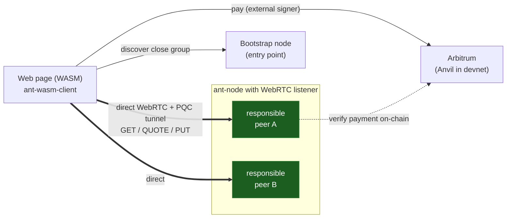

# Autonomi in the browser — WebRTC-Direct, no install, post-quantum, no relays

This repository is the **front door** to a working browser⇆Autonomi path: an
ordinary web page uploads and downloads files on a real Autonomi network over
**WebRTC-Direct**, with **no browser extension, no local daemon, no gateway**,
and **no node relaying anyone else's traffic**. Every chunk is content-verified
and every session is post-quantum encrypted at the application layer.

It ties together two code deliverables (as git submodules) and the design +
evidence that explain them.



> **The one idea:** WebRTC is used purely as a browser-reachable UDP
> replacement. A bootstrap connection solves *initial contact only*; the
> browser then discovers the peers responsible for an address and opens its
> **own direct WebRTC connections** to them — fetching, quoting, paying and
> storing directly, exactly like the native client. Load spreads across the
> network; no node carries another node's payload.

## 🌐 Live demo

**<https://webrtc-demo.autonomi.space>** — the page comes from an ordinary
web server; the files on it do not. The browser pulls them chunk-by-chunk
over direct WebRTC connections from a **public 20-node devnet running RFC 9443
single-port mode**: QUIC and WebRTC share **one UDP socket per node**.
Unofficial community demo, not operated by Autonomi. (Fun detail: the
`BegBlag.mp3` there has the exact same content address as on mainnet.)

## What's here

| Path | What it is | Home |
|---|---|---|
| `ant-node/` (submodule) | The node change: a feature-gated WebRTC-Direct listener + peer discovery, sharing the existing request handler and node identity. **This is the upstream contribution** (ADR-0010). | fork of `WithAutonomi/ant-node`, branch `feat/webrtc-direct-listener` |
| `ant-wasm-client/` (submodule) | The browser SDK + demo webapp: connect, discover, download, upload, pay. Standalone, `wasm-bindgen` based. | its own repo |
| `saorsa-transport/` (submodule) | Two small additive patches for single-port: `P2pConfig::abstract_socket` (QUIC endpoint runs on a caller-provided socket) + disabling QUIC bit greasing on injected sockets (RFC 9287 §4 — required when demultiplexing). **PR-ready upstream ask.** | fork of `WithAutonomi/saorsa-transport`, branch `feat/abstract-socket-injection` |
| `saorsa-core/` (submodule) | The passthrough: `NodeConfig::injected_sockets` hands a pre-bound socket per address family down to saorsa-transport. **PR-ready upstream ask.** | fork of `WithAutonomi/saorsa-core`, branch `feat/abstract-socket-injection` |
| `docs/` | The design and the evidence — start with [`docs/ARCHITECTURE.md`](docs/ARCHITECTURE.md) and [`docs/FINDINGS.md`](docs/FINDINGS.md). | here |
| `ant-client/` | The official CLI, used unmodified as the baseline/oracle for round-trip tests. | clone of `WithAutonomi/ant-client` |

The single-port node work lives on `ant-node` branch
`feat/rfc9443-single-port-prep` (first-byte demux per RFC 9443, shared-socket
session mux, `--webrtc-single-port`; ADR-0011).

`.janus/` (if present) is the internal project tracker; `docs/` is the
external distillation.

## Status — verified end to end (local devnet, real nodes, Anvil EVM)

- **Download** from Chrome: discover the close group via the bootstrap
  connection, fetch every chunk **directly** from the responsible peers,
  BLAKE3-verify and decrypt in the browser. 5 MiB in **0.46 s** (parallel
  fetch), SHA-256 identical to the source.
- **Upload** from Chrome, **no MetaMask required**: self-encrypt in WASM →
  quotes from the close group (ML-DSA-65 verified) → on-chain
  `approve`+`payForQuotes` (Anvil) → `PUT` with `ProofOfPayment` directly to
  the storing nodes → accepted after their **on-chain** payment verification.
  The native `ant` CLI then downloads the browser-uploaded file
  byte-identically. (A MetaMask payer is wired for interactive use.)

- **Single port (RFC 9443)**, verified on the public demo devnet: with
  `--webrtc-single-port` a node serves QUIC **and** WebRTC on its one UDP
  port — datagrams are routed by first byte (STUN 0–3 / DTLS 20–63 → WebRTC;
  QUIC 64–127 / 192–255 → QUIC). `lsof` shows a single socket per node.
  Two findings from running this for real: QUIC bit greasing must be off on
  a demultiplexed port (RFC 9287 §4), and an ICE host candidate can never be
  an unspecified bind address (hence `--webrtc-advertise-ip` / devnet
  `--host`). IPv4-only for now (saorsa-core has no v6-only listen mode).

Evidence: [`docs/evidence/`](docs/evidence).

## Run the full loop locally

```sh
# 1. node + CLI (release)
cargo build --release --features webrtc --manifest-path ant-node/Cargo.toml
cargo build --release --manifest-path ant-client/Cargo.toml
cp ant-client/target/release/ant ant-node/target/release/ant-cli   # for scripts/test_e2e.sh

# 2. a local devnet with real nodes, a per-node WebRTC listener, and Anvil
#    (needs foundry/anvil on PATH)
ant-node/target/release/ant-devnet --preset small --enable-evm \
    --webrtc-port 25000 --manifest /tmp/devnet.json --data-dir /tmp/devnet

# 3. build the browser client + serve the demo
cd ant-wasm-client
cargo build --target wasm32-unknown-unknown --release
wasm-bindgen --target web --out-dir web/pkg \
    target/wasm32-unknown-unknown/release/ant_wasm_client.wasm
cp /tmp/devnet.json web/devnet-manifest.json
python3 -m http.server 8080 --directory web    # open http://127.0.0.1:8080
```

On the page: **Manifest laden** → **Datei wählen → hochladen** (pays over
Anvil by default) → the returned address downloads byte-identically, in the
page or via `ant file download <address>`.

## Reading guide

1. [`docs/ARCHITECTURE.md`](docs/ARCHITECTURE.md) — the layer model, the
   no-relay design (with diagrams), and the invariants any implementation
   must keep.
2. [`docs/COMPARISON.md`](docs/COMPARISON.md) — classic native
   `ant-client ⇆ ant-node` vs. this browser path, with upload/download
   sequence diagrams.
3. [`docs/POST-QUANTUM.md`](docs/POST-QUANTUM.md) — a map of exactly where
   data is post-quantum secure and where the remaining classical crypto is
   (and why it doesn't touch the data path).
4. [`docs/FINDINGS.md`](docs/FINDINGS.md) — what was verified in code and
   against a real network: the str0m transport choice, the PQC tunnel, the
   bugs found and fixed, benchmarks.
5. `ant-node/docs/adr/ADR-0010-webrtc-direct-browser-listener.md` — the
   proposed design record for the node change; `ADR-0011-rfc9443-single-port-mode.md`
   (on branch `feat/rfc9443-single-port-prep`) for single-port mode.

## Open points / not yet done

- **MetaMask path** is wired but only interactively testable (the Anvil
  payer is the default, no-click path).
- **NAT'd nodes without port forwarding**: ICE signaling (STUN reflector +
  SDP relay + full-ICE answerer) is implemented on both sides and verified
  end to end on a loopback devnet — the browser fetches a chunk from a
  non-bootstrap node reached purely via relayed ICE signaling. Loopback
  exercises the full mechanism; true NAT hole-punching additionally needs
  real NAT + per-socket reflexive candidates. Cone NAT reachable; symmetric
  NAT a deliberate loss (see ARCHITECTURE).
- **Large files**: supported both directions via shrunk data maps (verified:
  20 MiB CLI-upload → browser download, 14 MiB browser-upload → CLI download,
  byte-identical).
- **Upstream MR** into `WithAutonomi/ant-node`: needs a Linear issue and
  likely slicing (GET+discovery+ADR → full chunk pass-through+devnet →
  RFC 9443 single-port). The saorsa hooks (`abstract_socket` /
  `injected_sockets`) are separate small additive PRs to
  saorsa-transport/saorsa-core. The on-chain **ECDSA payment signature** is
  the only non-PQ surface (inherent to Arbitrum; see POST-QUANTUM.md).
- **`--host` devnets and external *CLI* clients:** DHT peer discovery hands
  external CLI clients 0 peers because all nodes share one IP, so
  saorsa-core's source-disjoint address proof can never pass. The browser
  path is unaffected (WebRTC discovery uses its own info lane); uploads are
  done server-side. Pre-existing upstream behaviour, documented here for
  honesty.
- Two `ant-node` e2e integration tests were flaky under heavy parallel load;
  re-check on an idle machine against upstream `main`.
