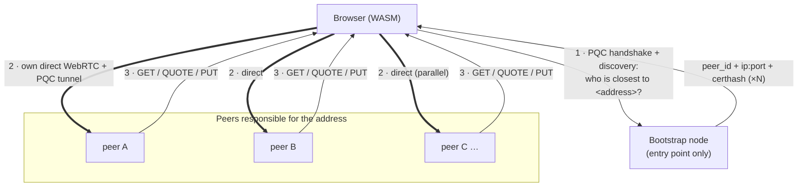

# Architecture

## The layer model

WebRTC-Direct is a **browser-reachable substitute for raw UDP** — morally the
same untrusted carrier native nodes already use. It contributes nothing to the
security model:

- **Content integrity** — a content address *is* the BLAKE3 hash of the chunk;
  the browser recomputes it for every chunk before use. A serving node can
  refuse, but it cannot tamper or substitute undetected.
- **Confidentiality + authentication** — a mandatory application-layer PQC
  tunnel inside every DataChannel: ML-KEM-768 key exchange, ML-DSA-65 server
  authentication bound to the node's identity (`PeerId = BLAKE3(pubkey)`, the
  same identity the QUIC lane and payment quotes use), ChaCha20-Poly1305 per
  message. Browser DTLS is classical (P-256), so all post-quantum properties
  live here, one layer up — exactly as they live above raw UDP today.
- **Payment** — unchanged and always on: storing nodes verify the
  `ProofOfPayment` on-chain regardless of how the request arrived.

The DTLS certificate is therefore a **connection identifier, not a security
instrument**: static, generated once, no rotation, no expiry. A node's
browser-facing address `ip:port + certhash` is a durable fact — the reason
WebRTC-Direct is chosen over WebTransport (whose pinned certs expire every 14
days and would force pre-generated certificate schedules).

## No relays — direct connections to the responsible peers

The bootstrap connection solves **initial contact only**. From there the
browser behaves like the native client:

A node relays a bytes-sized *question* (discovery), never a payload. Each
responsible peer gets its own connection; fetches run in parallel.

- **Discovery** (tunnel tag `0x02`): a node answers *which* peers are closest
  to an address and hands back their direct connect facts. Peer connect facts
  (WebRTC port + cert hash) are learned node-to-node over a tiny QUIC-lane
  protocol (`autonomi.ant.webrtc-info.v1`) and cached. The answering node
  relays a bytes-sized *question*, never a payload.
- **Chunk protocol** (tunnel tag `0x01`): the full `autonomi.ant.chunk.v1`
  request set (GET, quotes, paid PUT) passes straight through to the shared
  `AntProtocol::try_handle_request` — the same handler the QUIC lane uses. A
  GET miss answers `NotFound`; the browser simply asked the wrong peer and
  moves on.

Why this matters: load spreads across the whole network instead of
concentrating on bootstrap/relay nodes, total work is lower than any relay
design, and the browser's trust assumptions are identical to the native
client's.

## Node side (feature `webrtc`, ADR-0010)

A listener that mirrors `RunningNode::start_protocol_routing`: it owns a UDP
socket, runs str0m's sans-IO loop per connection, and feeds decrypted request
frames to `AntProtocol::try_handle_request`. **No changes to saorsa-core /
saorsa-transport, storage, payment, or replication.** Off by default; enabled
per node with `--webrtc-port` (within the 10000–10999 node range). The devnet
runs a listener on every node (`base + index`) and publishes the bootstrap
node as the entry point in its manifest.

Transport: **str0m** (sans-IO, ICE-lite, passive DTLS, negotiated DataChannel,
fingerprint-pinned). Chosen over the classic `webrtc-rs` line because the
latter still stalls DataChannel writes over 16 KiB and is DTLS-1.2-only, while
str0m speaks DTLS 1.2 **and** 1.3 (see FINDINGS).

## Browser side (`ant-wasm-client`)

A `NodeConnection` wraps one node's WebRTC transport + PQC session and speaks
both tunnel lanes; a per-connection async lock keeps overlapping round-trips on
one connection from racing while fetches across different connections run in
parallel. `WasmClient` holds a bootstrap connection plus an on-demand pool of
direct peer connections. The verified-retrieval state machine (address
verification, data-map walking, self-decryption) and the byte-exact
`PaymentQuote`/`ProofOfPayment` mirrors are the trust-bearing pieces — the
transport is interchangeable.

## Invariants any implementation must preserve

1. The client verifies every chunk against its BLAKE3 address.
2. The transport carries only ciphertext it cannot read and cannot usefully
   forge; post-quantum protection is application-level, never delegated to the
   browser's DTLS.
3. Payment verification stays always-on and on-chain at the storing node.
4. A node answers questions and serves its own data; it never relays another
   node's payloads.

## Deliberately out of scope (for now)

- **NAT'd nodes without port forwarding** — the established connection can
  double as an ICE signaling relay (offer/answer/candidates are bytes, not
  payloads) so browsers hole-punch to such peers. Designed, not yet built.
- **Node-to-node WebRTC** — QUIC remains the right node transport; WebRTC
  earns its place only as the browser-facing edge.
- **Shrunk (very large) data maps in the browser client** — the flat-map path
  is implemented; recursive shrink resolution is a follow-up.
