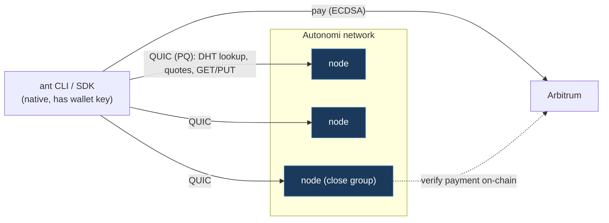
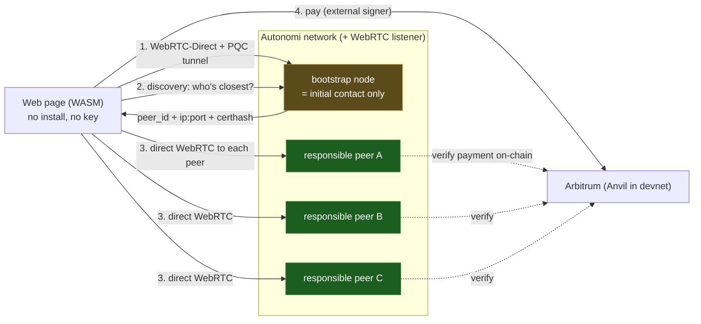
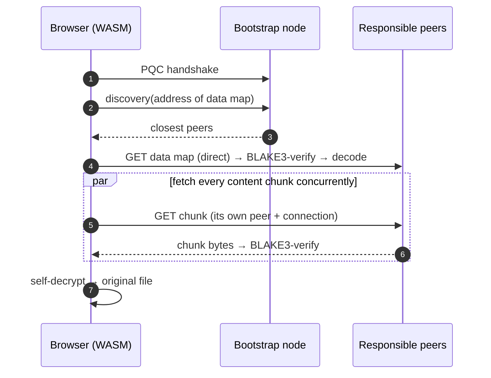

# Classic Autonomi vs. this browser path

## What changes, at a glance

| Aspect | Classic (native CLI/SDK) | This work (browser) |
|---|---|---|
| Client runtime | native binary (`ant`), tokio | WASM in any web page, no install |
| Transport to nodes | saorsa-transport **QUIC** (raw UDP) | **WebRTC-Direct** DataChannel (UDP-equivalent the browser can open) |
| Reaching a node | raw socket to `ip:port` | munged-SDP WebRTC to `ip:port` + pinned cert hash, no signaling server |
| Transport PQ | QUIC TLS is PQ (ML-KEM/ML-DSA) | DTLS is classical → **app-layer PQC tunnel** restores PQ |
| Peer discovery | Kademlia DHT, client is a DHT peer | client asks a connected node for the close group, then connects directly |
| Node change required | — | a feature-gated listener + discovery lane; **same request handler** |
| Payment signing | local key / wallet | external (Anvil unlocked account, or MetaMask) — no key in the client |
| What the node does for a browser | (n/a) | answers questions and serves its own data; **never relays payloads** |

The node's storage, payment verification, replication and identity are
**untouched** — the browser lane shares `AntProtocol::try_handle_request` with
the QUIC lane.

## Classic path — native client over QUIC



## Our path — browser over WebRTC-Direct, no relay



The bootstrap node is only the address book. Data flows browser⇄responsible
peers directly, spreading load across the network — the native client's access
pattern, reproduced from a web page.

## Upload sequence (browser, no MetaMask required)

```mermaid
sequenceDiagram
    autonumber
    participant B as Browser (WASM)
    participant Boot as Bootstrap node
    participant CG as Close-group peers (×7)
    participant EVM as Arbitrum / Anvil
    B->>B: self-encrypt file → chunks + data map
    B->>Boot: PQC handshake + discovery (per chunk)
    Boot-->>B: closest peers (ip:port, certhash, peer_id)
    B->>CG: direct WebRTC + PQC tunnel to each peer
    B->>CG: ChunkQuoteRequest
    CG-->>B: signed quotes (ML-DSA-65)
    B->>B: verify quotes, pick median×3 split, build calldata
    B->>EVM: approve + payForQuotes (external signer)
    EVM-->>B: tx hash
    B->>CG: ChunkPutRequest + ProofOfPayment
    CG->>EVM: verify payment on-chain
    CG-->>B: stored ✓
    Note over B,CG: repeat per chunk; data map chunk stored last → its address = the file address
```

## Download sequence (parallel, verified)


