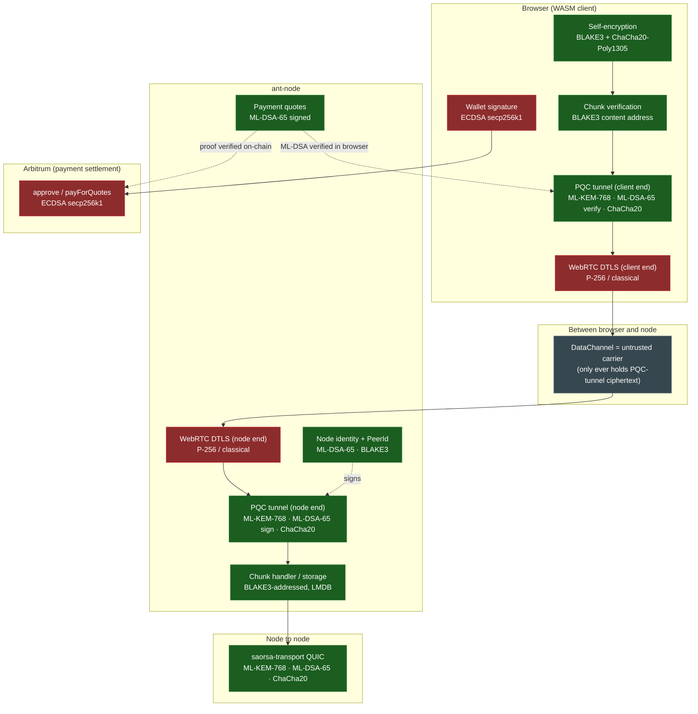

# Post-quantum security map

**Short version:** every byte of *stored and transferred content*, and every
piece of *network identity and authentication*, is post-quantum secure. The
only classical cryptography left is (a) the browser's DTLS transport wrapper,
which protects nothing that isn't already post-quantum protected inside it, and
(b) the Ethereum/Arbitrum payment signatures, which are inherent to the chain
and outside Autonomi's control.

## Where the crypto lives

Green = post-quantum. Red = classical. Grey = untrusted carrier (holds only
already-encrypted bytes).

## The table

| Layer | Primitive | Quantum-safe? | Why it's fine / what's at risk |
|---|---|:---:|---|
| Content addressing | BLAKE3 (256-bit) | ✅ | Grover only halves it → 128-bit effective; content integrity intact. |
| Self-encryption (stored data) | BLAKE3 XOF + ChaCha20-Poly1305 | ✅ | Symmetric/convergent; the actual file bytes are PQ-safe at rest and in flight. |
| App-layer tunnel — key exchange | ML-KEM-768 (FIPS 203) | ✅ | Fresh per session; protects data maps, addresses, request patterns. |
| App-layer tunnel — authentication | ML-DSA-65 (FIPS 204) | ✅ | Node signs the handshake; browser pins `PeerId = BLAKE3(pubkey)`. |
| App-layer tunnel — session cipher | ChaCha20-Poly1305 | ✅ | 256-bit symmetric. |
| Node identity / PeerId | ML-DSA-65 + BLAKE3 | ✅ | Same identity on the QUIC lane, the WebRTC lane and payment quotes. |
| Payment quote signatures | ML-DSA-65 | ✅ | The browser verifies each quote before paying. |
| Node↔node transport | saorsa-transport QUIC: ML-KEM-768 + ML-DSA-65 | ✅ | Pure PQ, no hybrid fallback. |
| **Browser DTLS transport** | **P-256 ECDHE, classical** | ❌ | **Irrelevant to data security:** it wraps only PQC-tunnel ciphertext — breaking it reveals nothing readable, exactly like raw UDP being unencrypted for native nodes. |
| **WebRTC cert keypair** | **ECDSA P-256, classical** | ❌ | **A connection identifier, not a data protector.** Pinned by SHA-256 fingerprint (the hash itself is PQ-safe). |
| **On-chain payment signature** | **ECDSA secp256k1 (Ethereum)** | ❌ | **Inherent to Arbitrum/Ethereum**, not our design. What's at risk is the payment transaction, never the stored data. A future PQ signature scheme is an Ethereum-ecosystem concern. |

## The one honest caveat, stated plainly

Calling this "end-to-end post-quantum" is accurate **for the data path**: from
the application layer on the browser to the application layer on the node,
every byte of communicated content is post-quantum protected, independent of
any browser capability. "But WebRTC/DTLS isn't quantum-safe" is a category
error — the same way native nodes are end-to-end PQ *despite* running over
unencrypted UDP, because all protection lives one layer up.

The genuinely non-PQ surface is the **Ethereum payment signature** (ECDSA).
That is a property of the settlement chain, shared by every Autonomi client
(native CLI included), and unchanged by this work.
